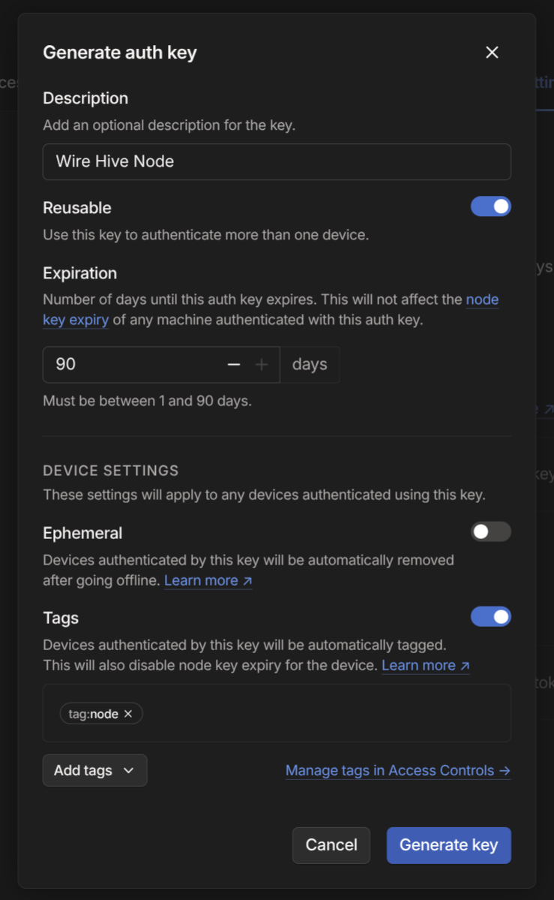

# Securing Root SSH

## The Problem

Wire cannot **interactively** raise sudo on **remote** nodes. It is currently a
limitation of wire itself [^1].

[^1]:
    Every time wire runs a remote command, sudo will require a password. This
    is because every `ssh` session is a new shell.

You must have `dpeloyment.target.user` set to a user that can run sudo without a
password or authentication, most commonly root.

This limitation means you can apply `push` and `build` while `deployment.target.user != "root"`,
but you cannot `apply` or `keys` **on remote nodes**.

::: info
When your deploying to your _local_ system, wire can interactively run sudo!
There is no need to use `wire` as root.
:::

However, there are alternative methods to authenticate `ssh root@node` without
requiring "interaction".

## Hardening `root` with Tailscale Checks

[Tailscale](https://tailscale.com/kb/1151/what-is-tailscale) can place a OAuth
check gate on any ssh user. This will require you re-authenticate with tailscale
in a browser to deploy your nodes. It looks like this:

```txt
lib::hive::steps::ping: Attempting host media
lib::nix_log: Store URL: ssh://root@media
lib::nix: # Tailscale SSH requires an additional check.
lib::nix: # To authenticate, visit: https://login.tailscale.com/a/XXXXXXXXXXXXXXX
lib::nix: # Authentication checked with Tailscale SSH.
lib::nix: # Time since last authentication: 1s
lib::hive::node: Executing step `Push the key agent`
```

### Step 1. ACLS

To setup root checking, we will create an access control tag and require checks
to access `root`. The ALCS can be modified on your tailnet dashboard.

```json [login.tailscale.com/admin/acls/file]
{
  "tagOwners": {
    "tag:node": ["autogroup:admin"]
  },

  "ssh": [
    {
      "src": ["autogroup:members"],
      "dst": ["tag:node"],
      "users": ["root"],
      "action": "check",
      // change check period to taste
      "checkPeriod": "12h"
    }
  ]
}
```

### Step 2. Updating the hive

You now must now tell wire to use the machine's tailnet DNS name
(or IP Address, but it may change). You can specify multiple hosts, so also include the node's non-tailnet IP
in-case your recovering the node outside of your tailnet.

```nix:line-numbers [hive.nix]
let
  sources = import ./npins;
  wire = import sources.wire;
in wire.makeHive {
  meta.nixpkgs = import sources.nixpkgs { };

  node-a = {
    deployment = {
      target = {
        host = "10.1.1.2"; # [!code --]
        hosts = [ # [!code ++]
            # Tailnet Name // [!code ++]
            "node-a" # [!code ++]
            # Some other accessible IP // [!code ++]
            "10.1.1.2"; # [!code ++]
        ]; # [!code ++]

        # ...
      };
    };

    imports = [./node-a/configuration.nix];
    # ...
  };

  # ...
}
```

### Step 3. Disabling `root` outside of your Tailnet

All nodes in your tailnet have an IPv4 in the range `100.64.0.0/10` [^2]. We can
tell openssh to refuse root connections from outside of this rnage.

[^2]: ["Tailscale - IP pool"](https://tailscale.com/kb/1304/ip-pool)

```nix:line-numbers [node-a/configuration.nix]
let
  tailnetRange = "100.64.0.0/10";
in
{
  # ...

  services.openssh = {
    enable = true;
    # Optional but recommended, disables password logins
    # and requires you have a public key specified for your
    # users.
    settings.PasswordAuthentication = false;
    settings.KbdInteractiveAuthentication = false;

    # Disable root lgoins
    settings.PermitRootLogin = "no";
    # Allow root logins in the tailnet ip range
    extraConfig = ''
      Match Address ${tailnetRange}
          PermitRootLogin yes
    '';
  };

  # ...
}
```

### Step 4. Enable Tailscale SSH

You must provide a authKeyFile to tailscale if you want your node to always
authenticate to tailscale. This can easily be achieved with a wire secret.

[Generate an Auth Key](https://tailscale.com/kb/1085/auth-keys), and ensure it
is:

- Reusable: Yes
- Ephemeral: No
- Tags: Yes
  - `tag:node` ([from your acls](#step-1-acls))

::: details Example Key Image

:::

Save and encrypt your key, ready to be deployed. Given that the key must exist
**before** tailscale starts, make sure that the key is `uploadAt =
"pre-activation"`.

```nix:line-numbers [node-a/configuration.nix]
{ config, ... }:
{
  # ...

  services.tailscale = {
    enable = true;
    authKeyFile = config.deployment.keys."tailscale.key".path;
    extraUpFlags = [ "--ssh" ];
  };

  deployment.keys."tailscale.key" = {
    keyCommand = [
      "gpg"
      "--decrypt"
      "${secrets/tailscale.key.gpg}"
    ];

    uploadAt = "pre-activation";
  };

  # ...
}
```

## Using a yubikey
