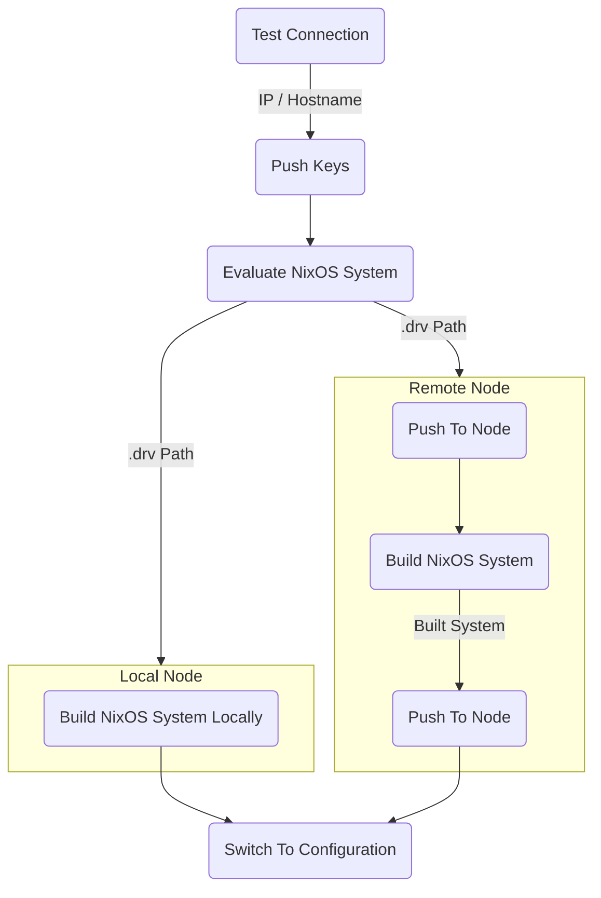

# {{ $frontmatter.title }}

{{ $frontmatter.description }}

## What does it mean to 'apply'?

Once you have [created a hive](./getting-started), you can now "apply" your
configuration to nodes in your hive. Simply, "applying" is the term used by wire to describe **deploying the
config**.

::: info
Applying a node typically involves pushing keys,
evaluating the node's NixOS system, building the node's NixOS system, and running
`switch-to-configuration`, depending on which specific goal is used.
:::

The simplest way to apply is simply running:

```sh
wire apply switch
```

Which will `switch` to each node's NixOS system in your hive and push
secrets (the equivalent to `nixos-rebuild`'s `nixos-rebuild switch`).

::: details Apply Goal Flowchart
The following is an illustrative flowchart of how each step in the apply execution is ran.

Depending on the specific goal certain steps will not run, for example the
Switch to Configuration step will never run if the goal is `build`.



:::

## Apply goals

`wire apply` accepts a goal, which include verbs which will be familiar to
`nixos-rebuild` users such as `switch`, `boot`, and `test`, alongside additional verbs
like `keys` and `push`.

### `wire apply keys`

Wire will push all deployment keys to nodes, and do nothing else. While running
this goal, option
[`deployment.keys.<name>.uploadAt`](/reference/module#deployment-keys-name-uploadat)
has no effect and all keys will be pushed. Read [the secret management guide](./keys)
to learn more about wire deployment keys.

### `wire apply push`

Wire will "push" (equivalent to [`nix
copy`](https://nix.dev/manual/nix/2.18/command-ref/new-cli/nix3-copy)) the
`.drv` file that can produce the node's NixOS system when built.

### `wire apply build`

Sister to `wire apply push`, wire will build the
node's NixOS system and ensure the output path exists on the node. Depending on
[`deployment.buildOnTarget`](/reference/module#deployment-buildontarget), the
`.drv` file may be built on the machine invoking wire or the node itself.

### `wire apply [switch|boot|test|dry-activate]`

Type `wire apply --help` or
[read the reference](../reference/cli#wire-apply) to read more.

## Applying locally

If `deployment.allowLocalDeployment` is `true`, and the machine invoking wire's
host name is equivalent to a node's name, wire will apply that node to the local
machine. Goals like `push` and `build`, wont actually "push" anything as
the paths already exists on the local machine.

When applying to your local machine, wire can interactively run `sudo`!
Wire will prompt for your password, meaning wire can be ran as any user in
the `wheel` group.

## Applying specific nodes

Use the `--on` argument to specify which nodes in your hive to apply:

```sh
wire apply --on node-a
```

Further examples, including how you can utilise tags, can be found on the [Targeting Nodes](./targeting) page.
